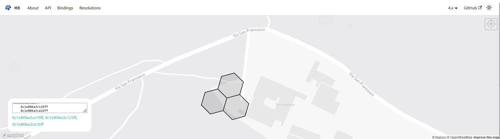
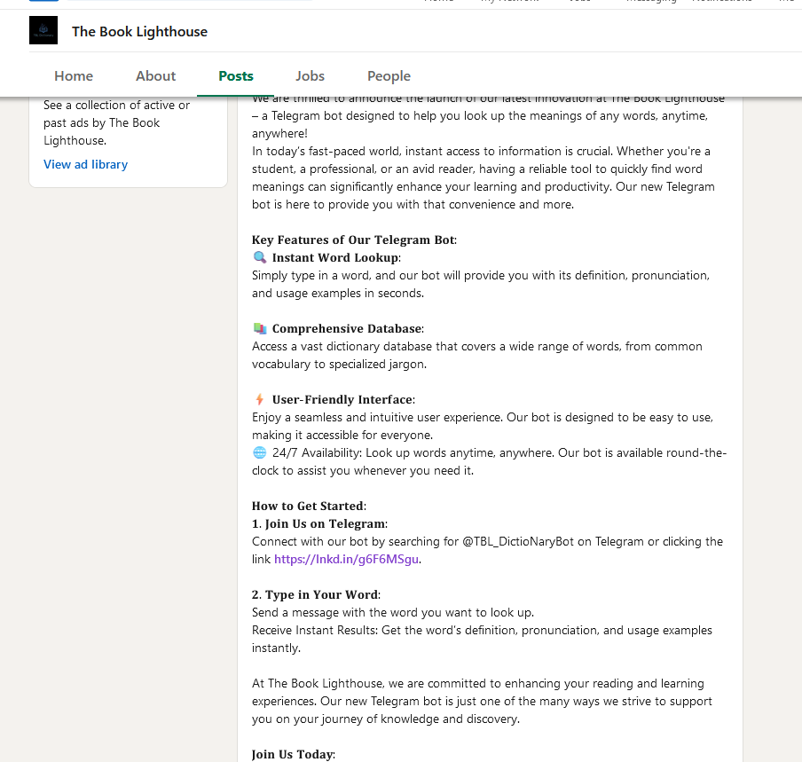

# Navigating the Digital Labyrinth
## TISC Level 1
### Description

The dust has settled since we won the epic battle against PALINDROME one year ago.

Peace returned to cyberspace, but it was short-lived. Two months ago, screens turned deathly blue, and the base went dark. When power returned, a mysterious entity glitched to life on our monitors. No one knows where it cam efrom or what it plans to do.

Amidst the clandestine realm of cyber warfare, intelligence sources have uncovered the presence of a formidable adversary, Vivoxanderith - a digital specter whose footprint spans the darkest corners of the Internet. As a skilled cyber operative, you are entrusted with the cirtiical mission of investigating this elusive figure and their network to end their reign of disruption.

Recent breakthroughs have unveilved **Vivoxanderith's online persona: vi_vox_223**. This revelation marks a pivotal advancement in our pursuit, offering a significant lead towards identifying and neutralizing this threat.

Our mission now requiires a meticulous investigation into **vi_vox223**'s activities and connections within the cyber underworld. Identifying and tracking Vivoxanderith brings us one crucial step closer to uncovering the source of the attack and restoring stability to our systems. It is up to you, agent!

# Solution

1. Search for vi_vox223 on Instagram
2. View his Discord story
3. Add in Discord bot `1284162498966192270` by finding another discord bot, then copy its invite link.
4. Then replace the the end of the link with has `ID=xxxxxx` with the number provided in his story

After adding the bot into your server, 
1. Add the discord role "D0PP3L64N63R" to the server
2. Assign the role to your account
3. Enter !help

#### Output from the bot   
````
Here are the available commands:
!help - Shows the available commands
!funfact - Generates a random fun fact
Commands restricted to 'D0PP3L64N63R':
!list - Lists the available files in the system.
!read <filename> - Reads the content of a specified text file.
!display <filename> - Displays the specified image file.
!download <filename> - Downloads a specified file.
````


#### !list
````
File List:
ReadMe.txt
Notes.txt
Test.txt
Usernames.txt
Password.txt
EmailAttachment_020524.png
EmailAttachment_130424.png
EmailAttachment_030124.png
Update_030624.eml
````

Under the list of files, download the Update_030624.eml
```` 
!download Update_030624.eml
````
Then view the download eml using a viewer. Can be found online.


#### Update_030624.eml
````
Dear Headquarters, 

I trust this message reaches you securely. I am writing to provide an update on my current location. I am currently positioned close to the midpoint of the following IDs:

    8c1e806a3ca19ff 
    8c1e806a3c125ff 
    8c1e806a3ca1bff 

My location is pinpointed with precision using Uber's cutting-edge geospatial technology, which employs shape-based location triangulation and partitions areas of the Earth into identifiable cells.

To initiate secure communication with me, please adhere to the discreet method we've established. Transmit the identified location's name through the secure communication channel accessible at https://www.linkedin.com/company/the-book-lighthouse

Awaiting your confirmation and further operational directives. 

Best regards, 

Vivoxanderith
````


Google for Uber H3
The website https://h3geo.org/ will appear, enter the website
Add in the coordinates that was found in the Update_030624.eml



Find the location on Google maps.

The location is: **Quercia Secolare**

There's also a Linkedin profile that was mentioned in the Update_030624.eml file
https://www.linkedin.com/company/the-book-lighthouse

Under the profile's posts, there's a link to a Telegram bot

https://lnkd.in/g6F6MSgu

Then give the location `Quercia Secolare` to the bot

Flag: TISC{OS1N7_Cyb3r_InV35t1g4t0r_uAhf3n}
